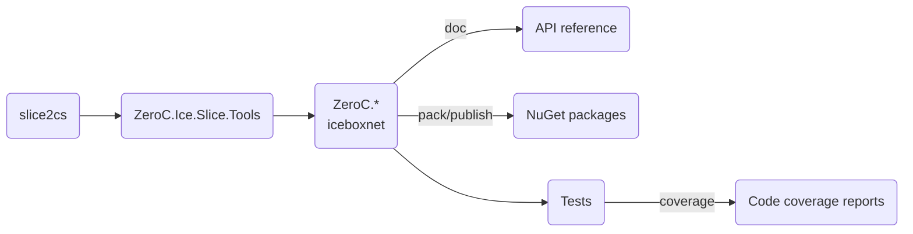

# Building Ice for C\#

This page describes how to build Ice for C# from source and package the resulting assemblies.

- [Building](#building)
  - [Prerequisites](#prerequisites)
  - [Compiling Ice for C-Sharp](#compiling-ice-for-c-sharp)
- [Running the Tests](#running-the-tests)
- [Packaging](#packaging)

## Building

### Build roadmap



### Prerequisites

1. .NET SDK 8.0 \
   Download the .NET SDK from [dotnet.microsoft.com](https://dotnet.microsoft.com/en-us/download/dotnet).

2. The Slice to C# compiler (slice2cs) from the C++ source distribution. \
   Refer to the [build instructions](../cpp/BUILDING.md) in the `cpp` folder for details on how to build the C++ source
   distribution.

3. Python 3.12 is required for running the tests. The Glacier2 test also require the `passlib` Python package.

### Building Ice for C\#

Open a command prompt and change to the `csharp` subdirectory. To build all Ice assemblies and the associated test
suite, run:

```shell
dotnet msbuild msbuild/ice.proj
```

## Running the Tests

To run the tests, open a command prompt and change to the `csharp` subdirectory. At the command prompt, execute:

```shell
python allTests.py --all
```

If everything worked out, you should see lots of `ok` messages. In case of a failure, the tests abort with `failed`.

## Packaging

To create the NuGet packages, open a command prompt and run the following command:

```shell
dotnet msbuild msbuild/ice.proj /t:Pack
```

This command creates all the NuGet packages.

You can publish these packages to your local `global-packages` source with the following command:

```shell
dotnet msbuild msbuild/ice.proj /t:Publish
```
